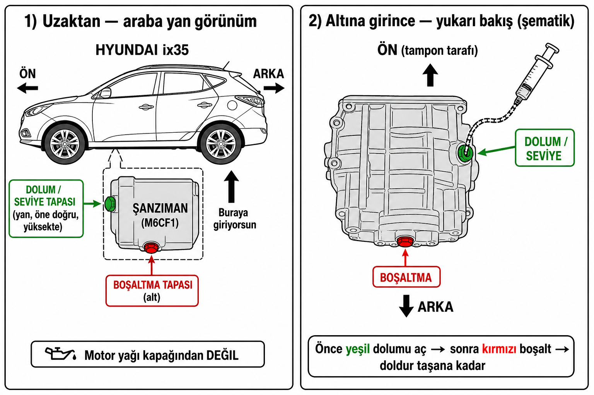
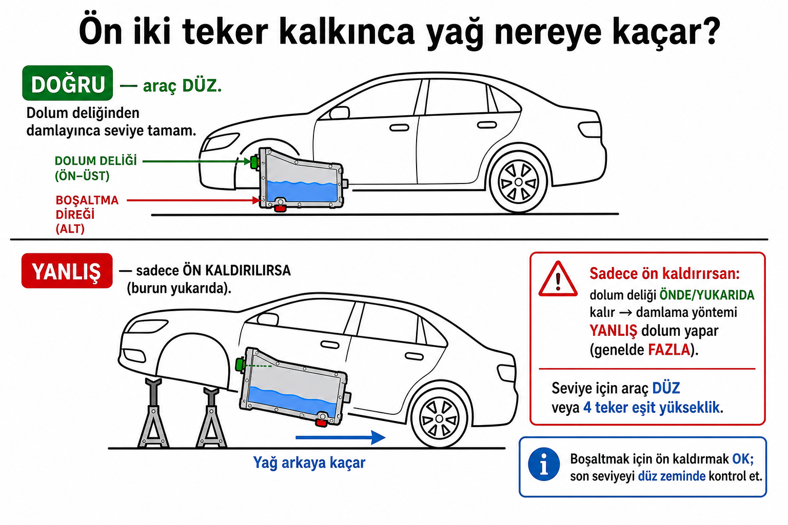

# Periyodik bakım — 132.000 km

> 2012 ix35 · 1.6 GDI · manuel · Prins LPG · **120 binde alındı**  
> Yağ **2026-08-18** değişti. Buji alışta değişti. LPG alışta takıldı. Alış yağında antifriz **koyuldu** (tam değişim teyitsiz).

Araç: [ozellikler.md](ozellikler.md) · [yapilanlar.md](yapilanlar.md)

---

## Sen değiştirebilirsin (DIY)

Yağ ve buji yaptın → aynı seviye bunlar:

| İş | Zorluk | Şimdi? |
|----|--------|--------|
| Yağ çubuğu | Kolay | Evet, her 1.000 km |
| **Polen filtresi** (torpido / eldiven gözü) | Kolay | Yağla aynı gün şart değil — ay başı / sonra olur |
| **Hava filtresi** (motor kutusu) | Kolay | Aynı; motoru durdurmaz, toz/hava biraz kirli kalır |
| Motor yağı + filtre | Yaptın | Sonraki **140 bin** |
| Buji | Yaptın (120 bin) | Hayır — LPG ile sonraki ~**160–180 bin** |
| PCV bak (kapak hortumu) | Kolay | Yağ eksiltirse |
| Manuel şanzıman yağı (~1,8 L, 75W-85 GL-4) | Orta (altına girmek, yağ değişimi gibi) | 132 bin, fiş yok: **acil değil**, bir kez bakım olarak mantıklı |
| Silecek, ampul, gözle balata/kayış | Kolay | Bak |

**V kayışı:** bakarsın (çatlak, tüy, gıcırdama). Sök-tak gergi yüzünden çoğu kişi ustaya bırakır; video + sehpa ile mümkün.

**Fren hidroliği / antifriz tam değişim:** teknik olarak sen; havasını almak / sistemi kanatmak hata kaldırır. İlk kez ise usta daha güvenli. Detay aşağıda.

---

## 1. Polen + hava — stokta, Sepete ekle (2026-08-18)

Yağ değişince bunları unutmak **sorun değil.** Motor yağı + yağ filtresi ayrı iş. **Polen** sadece kabin havası / koku / buğu. **Hava** motorun nefes borusu: kirliyse biraz daha toz kaçar, çekiş/yakıt çok az etkilenir; haftalar/aylar sonraya bırakmak motoru bozmaz. İkisini ay başı veya yağ/şanzıman sepetine koy. Yıllarca bekletme.

Kodlar (1.6 GDI 2010–2015): hava OEM **28113-2S000** (Mann **C26013**, Bosch **F026400228**). Polen OEM **97133-2E250 / 2E260** (Mann **CU24004**, Bosch **1987432224**). Karbonlu şart değil.

**Al:** Cepoto’dan ikisini bir sepete. Sayfada **Sepete ekle** vardı (STOK YOK değil).

| Ne | Marka / kod | Link | ~Fiyat |
|----|-------------|------|--------|
| **Hava (al)** | Bosch F026400228 | [cepoto.com/urun/f026400228-bosch](https://cepoto.com/urun/f026400228-bosch) | ~478 TL |
| **Polen (al)** | Bosch 1987432224 | [cepoto.com/urun/1987432224-bosch](https://cepoto.com/urun/1987432224-bosch) | ~625 TL |
| Hava yedek | Mann C26013 | [cepoto.com/urun/c26013-mann](https://cepoto.com/urun/c26013-mann) | ~536 TL |
| Polen yedek | Mann CU24004 | [cepoto.com/urun/cu24004-mann](https://cepoto.com/urun/cu24004-mann) | ~684 TL |

Aynı araç, ayrı mağaza: Mann hava [uzmanparca C26013 / 1.6 GDI](https://www.uzmanparca.com/urun/hyundai-ix35-1-6-gdi-benzinli-hava-filtresi-20102015-mann-filter_1813) (~485 TL, Sepete Ekle). Bosch polen [uzmanparca 2010–2015](https://www.uzmanparca.com/urun/hyundai-ix35-polen-filtresi-20102015-bosch_10276). OEM Mobis hava [hyundaiotoparca 28113-2S000](https://hyundaiotoparca.com/28113-2s000-hava-filtresi-ix-35-10-15-sportage-11-15-p-1229) (~800 TL, stokta / Sepete Ekle; kargo alıcı ödemeli).

**Alma:** 3’lü set (hava+polen+yağ) — yağ filtresini yeni değiştirdin. Ucuz isimsiz polen (SC698 vb.). Bosch **09864B5008** — ölçü farklı, Cepoto’da **STOK YOK**. “Gelince haber ver” yok.

**Takmak (kolay):**

- **Hava:** kaput → siyah kutu (hava kutusu) klipleri / vidalar → eski elemanı çıkar, kutuyu sil, yenisini conta oturacak şekilde koy, kapağı kapat.
- **Polen:** yolcu tarafı eldiven gözü → yanlardan sıkıştırıp indir → arkadaki kapak → eski filtreyi çek. Ok **hava akış yönüne** (genelde aşağı / kapaktaki ok). Gözü geri tak.

---

## 2. Yağ çubuğu — değişir mi?

**Evet, çubuk ayrı parça.** Motor açılmaz: lastik sapı çek, tüpten çıkar, yenisini aynı deliğe tam oturt. Yağ sızdırmazlık halkası sapta.

Ama **önce temizle, kör sipariş etme.** Yılların yağı çubuğun yüzünü boyar; seviye genelde **kenardaki çentik / delik** (L ve F), boyalı yüz değil.

1. Düz zemin, ılık motor, stop, ~5 dk.
2. Çek → kağıt havlu ile **sil** (fren temizleyici bezde, tüpe sıkma).
3. Tam tak → hemen çek. Islak sınır: L–F arası mı, çentiğe göre bak. Işık / telefon feneri.

Hâlâ okunmuyorsa: sapındaki kodu oku veya şase ile bayiye sor. **Kör Amazon “ix35 çubuk” alma** — `26611-03801` sonraki 1.4T / başka kasa. Gamma 1.6 GDI’de çoğu katalog **26611-2B000** der; ix35 2012 G4FD için **VIN teyidi şart**.

---

## 3. Şanzıman yağı nasıl değişiyor?

Motor yağı kapağından **değil.** Manuel kutu (**M6CF1**) ayrı kap: **altta boşaltma tapası**, **yanda dolum / seviye tapası**.

| | |
|--|--|
| Miktar | ~**1,8 L** |
| Yağ | **API GL-4**, **75W-85**. Saf **GL-5** (80W-90 vb.) koyma — senkrolar. |
| Tapa | Çoğu M6CF1: boşaltma **17 mm** altıgen. Dolum 17 veya **14 mm** (araca bak). **Yeni tapa alma** — eski vida durur. |
| Tork | ~59–78 Nm. Tork anahtarı yoksa sıkı sık, vida kırma. |
| Pul | Motor **14×20 değil.** Kutu tapasının kendi pulu (genelde **17511-16000**, ~16×24). Kılavuz yenisini ister; bu pul motorunki gibi ezilmez — yırtık/kayıp değilse **eski pul yeter**. |

Sıra (düz zemin, kutu ılık):

1. **Önce yan dolum tapasını gevşet / aç.** Açılmazsa altı açma — boşaltır boşaltmaz dolduramazsın.
2. Alt tapayı aç, kabın içine boşalt.
3. Alt tapayı **kendi pulu** ile sık (yeni tapa yok).
4. Yan delikten **taşana / damlayana** kadar doldur (seviye bu delik). Hortumlu **şırınga** ile bas — sifon pompa yukarı basmaz.

Motor yağı gibi “üstten 4 L dök” yok. Filtre yok; sadece yağ.

### Nerede? (şematik)



| Tapa | Renk (şematikte) | Konum | Ne işe yarar |
|------|------------------|--------|----------------|
| **Dolum / seviye** | Yeşil | Kutunun **yanında**, genelde **öne doğru / yüksekte** | Önce bunu aç. Doldururken buradan **damlayınca** seviye tamam (araç **düz**ken). |
| **Boşaltma** | Kırmızı | Kutunun **en altında** | Eski yağı buradan boşalt. |

Motor bölmesi kapağından değil — **altına giriyorsun** (ön alt / şanzıman gövdesi).

### Ön iki teker kalkınca — akacak yer önde mi arkada mı?



**Kısa:** Dolum deliği kutuda **öne / yukarı** tarafta. Sadece önü kaldırırsan burun yukarı → yağ **arkaya** kaçar. Dolum deliği o zaman yağın **üstünde / önde** kalır.

| İş | Sadece ön kaldırmak |
|----|---------------------|
| **Boşaltmak** | Olur (alt tapa yine en altta). |
| **Seviye / damlatarak doldurmak** | **Olmaz** — damlama yöntemi **yanlış** (genelde **fazla** doldurursun). |

**Doğru:** Son seviyeyi araç **düz**ken (veya 4 teker eşit yükseklikte) kontrol et. Pratik yol: önde sehpada boşalt + alt tapayı sık → arabayı **düz zemine indir** → dolum deliğinden şırınga ile taşana kadar doldur. (Altına girmek için yine hafif kaldırmak gerekirse dört köşe eşit veya rampada düz tut.)

Motor yağı gibi “üstten 4 L dök” yok. Filtre yok; sadece yağ.

**Kutuyu açmak yok.** Videoda tavayı indirip “içi demir / talaş, parmak sürt, filtre” diyenler **otomatik kutu**. Orada alt tava, mıknatıs ve filtre var; ATF değişiminde tavayı söküp bakıyorlar. Bu araç **manuel M6CF1, 2WD**: tava yok, filtre yok, mıknatıs yok. Yağ = altta **bir tapa**, yanda **bir tapa**. Kalıntıya bakacaksan boşalan yağa bak (kabın dibinde az pirinç/metal pulu ilk değişimde normal olabilir). Muhafaza vidalarına, yarım kutuya, tava contasına dokunma.

**Pul ≠ tapa.** Conta = tapadaki ezilme **pulu**, vida değil. Motor yağı **14×20 / 21513-23001**. Şanzıman tapası M16; 14×20 geçmez. OEM pul **17511-16000** (~16×24). Yeni vida **yok**. Eski pul yırtık/kaybolmuşsa o zaman bayi 17511-16000; duruyorsa takıp sık.

### Şırınga mı pompa mı — aynı alet, iki isim

Satıcılar “şırınga”, “şırınga pompası”, “sıvı çıkarıcı” yazıyor. **Ayrı iki alet değil.** Tıbbi iğne değil. Görselde bakacağın şey:

- Şeffaf silindir (üzerinde ml çizgisi). **250 cc** ucuz ve yeter; 500 cc daha az tur
- Üstte piston / sap — **çek = doldur, bas = bas**
- Alta **konik uç** + **esnek hortum** (hazır gelmezse ucuz 1 m hortum takılır)
- İğne yok. Teneke pompası, mazot pompası, gres tabancası **değil**

Hortum arabaya takılmaz. Ucu yağ şişesine, sonra kutunun **yan deliğine**.

```
[yağ şişesi] --hortum--> [şırınga gövdesi] --aynı hortum--> [kutunun YAN deliği]
                              piston çek = doldur
                              piston bas = kutuya bas
```

1. Hortumu gövdeye tak. Ucu **yağ şişesine** sok. Pistonu **çek**.
2. Ucu **yan dolum deliğine** sok (5–10 cm içeri).
3. Pistonu **bas**.
4. 250 cc ise ~1,8 L için **~8 tur**; 500 cc ise **~4 tur**. Damlayınca dur.

**Eski Amazon arama / çok satanlar linki yanlıştır** — o listeler mazot sifonu, teneke yağ pompası, gres tabancası karıştırır. Aşağıdaki ürün sayfalarına bak.

Boşaltma altta ayrı tapa; şırınga oraya değmez.

### Yağ uygun mu (Motylgear)

Fabrika kılavuzu (ix35 1.6 benzin, M6CF1): **API GL-4, SAE 75W-85**, ~**1,8 L**. Motul Motylgear 75W-85: viskozite **aynı**; TDS’de API **GL-4 / GL-5**, senkronize kutu, **sarı metal / conta OK**, Hyundai/Kia 75W-85 isteyen kutular için yazılmış. **Bu araç için uygun**, ucuz “şanzıman yağı” değil.

Tek nüans: OEM tam olarak **sadece GL-4**. Eski saf **GL-5** (özellikle 80W-90) senkro pirincini yer. Motylgear ikili etiket + sarı metal iddiası olduğu için **kullanılır**; “Hyundai kutusunun ta kendisi” değil. Sıfır şüphe OEM: **Hyundai/Kia MTF 75W-85 GL-4** (Mobis; eski kod **04300-00110**, güncel **04300-00140** civarı — bayi teyit). **Alma:** 80W-90, “GL-5 only”, diferansiyel yağı, Motylgear **75W-80 / 75W-90**.

### Orijinal Motylgear — nereden (araştırma 2026-09-01)

**Doğru ürün kimliği (kutuda bunlar olmalı):**

| | |
|--|--|
| İsim | Motul **MOTYLGEAR 75W-85** (1 L) |
| Motul SKU / art. | **106745** |
| EAN / barkod | **3374650259925** |
| Standart | API **GL-4 ve GL-5** (ikili); Made in **France** |
| Resmi TR ürün sayfası | [motul.com/tr-TR/products/44901](https://www.motul.com/tr-TR/products/44901) (katalogda var) |
| TDS (TR) | [MOTYLGEAR_75W-85 TDS PDF](https://azupim01.motul.com/media/motulData/DO/base/MOTYLGEAR_75W-85_tr_TR_motul_20210329.pdf) |

Piyasa fiyat bandı (1 L, bakıldığı gün): kabaca **~675–900 TL**. Bunun **çok altı** (ör. ~350 TL) → orijinal şüphesi; **çok üstü** → alma.

#### Kanallar — güven sırası

| Sıra | Kanal | Orijinallik | Stok / Sepete Ekle (o gün) | Not |
|------|--------|-------------|------------------------------|-----|
| **1** | **Bema Petrol — Motul Kayseri bölge distribütörü** | En yüksek (Motul’ün resmi listesi) | Mağaza/telefon; web shop değil | [Motul TR distribütörler](https://www.motul.com/tr-TR/discover-motul/distributors): Anbar Mah. Osman Kavuncu Bul. No:558E Melikgazi / Kayseri · **0 (352) 311 40 60** / **0532 516 48 24** · muhasebe@bemapetrolurunleri.com. **Şunu sor:** “Motylgear 75W-85, SKU **106745**, barkod **3374650259925**, 2 litre.” Yoksa **75W-80/90 alma**; sipariş açabilirler mi diye sor. |
| **1b** | Motul TR merkez | Doğrulama | — | **0216 570 65 00** / info@motul.com.tr — “75W-85 hangi yetkili stokta?” |
| **2** | **[shoptr.motul.com](https://shoptr.motul.com/)** — resmi Motul Shop TR | Resmi site | Şanzıman rafında **75W-85 yok** | Sadece **75W-80** ve **75W-90** listeleniyor (ikisi de bu kutu için **yanlış**). “Motul resmi site” diye **80/90 alma**. |
| **3** | **[Idefix Motylgear 75W85](https://www.idefix.com/motul-motylgear-75w85-1-litre-p-13160352)** | Yüksek (marketplace + doğru EAN) | **Sepete Ekle**, ~**847 TL**, stok **9** | Sayfa barkodu = resmi EAN **3374650259925**. İade/ödeme koruması var. Gelen şişede barkod + üretim tarihi kontrol et. |
| **4** | **[turkoilmarket](https://www.turkoilmarket.com/urun/motul-motylgear-75w-85-1-litre)** | Orta–iyi (yağ mağazası, resmi Motul değil) | **Sepete Ekle**, ~**750 TL**, InStock | Fiyat bandı içinde. Faturada ürün adı + mümkünse lot iste. |
| **5** | HB / n11 / Amazon TR | Satıcıya bağlı | Bot/403; tek tek satıcı puanı şart | **75W-85** + EAN doğrula. Az puanlı / aşırı ucuz satıcıyı ele. |
| — | Cepoto | — | Motylgear **yok** | Filtre sitesi; yağ buradan beklenmez. |
| — | madeniyagfiltre | Düşük | ~**357 TL** (bandın yarısı) | **Alma.** |
| — | Oilmarkt arama | — | 75W-85 Motylgear net değil; **75W-90** çıkıyor | Yanlış viskozite → alma. |

#### Kutuyu açınca kontrol (orijinal mi)

1. Etiket: **MOTYLGEAR** + tam **75W-85** (75W-80 / 75W-90 değil).  
2. Barkod okuyucu: **3374650259925**.  
3. **Made in France**, kapak/mühür bozulmamış, şişe şiş/ezik değil.  
4. Lot / üretim tarihi okunuyor; çok eski stok (yıllarca rafta) tercihen iade.  
5. Fatura sakla (garanti / iade).

#### Sıfır şüphe alternatifi (Motul bulunamazsa)

Yetkili **Hyundai bayi yedek parça**: Mobis **MTF 75W-85 GL-4** (~**04300-00110** / **04300-00140** — bayi kodunu teyit et). Fabrika spesifikasyonu; Motul muadili aramaya gerek yok. TR e-ticarette Sepete Ekle stoku zayıf göründü → **bayiden sipariş** daha güvenli. **2×1 L** (kapasite ~1,8 L).

### Şimdi değişsin mi — semptom bekleme

Motor yağı gibi 8 bin km’de bir **değil**. Kılavuz normal kullanımda çoğunlukla **inspect** (bak, gerekirse düzelt). Ağır kullanım tablosunda **120.000 km’de değiş**.

Bu araç **132 bin**, alış 120 bin, fiş yok. Vites yumuşaksa **bozulmuş / acil değil**. Ama “gıcırdayınca değişirim” **yanlış** — o ses genelde senkro aşınması, yağ geç kalmış olur.

Ne yap: fiş yok + 120 bin eşiği geçti → **bir kez bakım** mantıklı (bakımlı olsun diye, arıza bekleyerek değil). Sonra yine uzun aralık (onlarca bin km). Soğukta 1–2’ye sert, tıkırtı, uğultu varsa öne al.

### Alet sepeti (2026-09-01) — Sepete ekle

Motor yağını sen değiştirdin → sehpa, boşaltma kabı, 17 mm, eldiven, bez **zaten var**. Yeni gereken: **dolum şırıngası + yağ**. Tapa/pul: eskiler durur.

**Castrol / “aynı site” notu:** Repo’da motor yağının (Castrol 5W-30) **hangi siteden alındığı yazılı değil**. **Cepoto**’da Motylgear **yok**.

**Al — şırınga (ucuz yeter):** 250 cc şart değil. Hortumlu 60 ml aynı işi yapar; sadece tur sayısı artar.

| # | Ne | Neden | Link | Not |
|---|-----|--------|------|-----|
| 1 | **Artlantis 60 ml + hortum** (al) | Kutuda **100 cm hortum**. Tek paket, Sepete Ekle. 1,8 L ≈ **~30 tur**. Yağı biraz ılık tut. | [idefix Artlantis 60 ml, Sepete Ekle ~213 TL](https://www.idefix.com/plastik-siringa-hortumlu-buyuk-60-ml-1-paket-sivi-emme-enjektoru-okul-deney-evcil-hayvan-besleme-p-5160854) | Trendyol’da aynı Artlantis bazen ~**164 TL**. |
| 1b | Kompozit 250 cc (isteğe bağlı) | Daha az tur (~8). Hortum ayrı. | [kompozitpazari 250 cc](https://kompozitpazari.com/urun/siringa-250-cc-ml/) + [Sakura hortum ~25 TL](https://www.sakuraakvaryum.com/urun/akvaryum-hava-hortumu-1m/) | 60 ml aldıysan bunu alma. |
| 2 | **Yağ 2×1 L** — önce Bema / yoksa Idefix | Orijinallik: yukarıdaki tablo. Online: Idefix EAN doğrulanmış. | **Önce ara:** Bema Petrol Kayseri (yukarı). **Online:** [Idefix ~847 TL, Sepete Ekle, EAN 3374650259925](https://www.idefix.com/motul-motylgear-75w85-1-litre-p-13160352) · yedek [turkoilmarket ~750 TL](https://www.turkoilmarket.com/urun/motul-motylgear-75w-85-1-litre) | Sepete **2 adet**. Gelen şişede barkod kontrol. Motul Shop TR **75W-80/90 alma**. |

**Yoksa al (evde 17 mm varsa 1’i atla):**

| Ne | Link | Stok (bakıldığı gün) |
|----|------|----------------------|
| 17 mm kombine (kısa) | [tuzlahirdavat İzeltaş 0320020017](https://tuzlahirdavat.com.tr/17-mm-kombine-anahtar-kisa-boy-izeltas) | **Var**, Sepete Ekle ~208 TL |
| 14 mm | Hırdavat / Trendyol “14 mm kombine”, **Sepete ekle** | Tuzla 14 mm o gün **stok yoktu** — “haber ver” yok |

**Alma (yağ / alet):**

- Motul Shop TR **Motylgear 75W-80** veya **75W-90** — resmi site olsa da **yanlış viskozite**.
- **madeniyagfiltre** ~357 TL; aşırı ucuz / az bilinen.
- Cepoto Motylgear yok. Oilmarkt **75W-90**. Saf GL-5 80W-90.
- DORF / Cadırcı pahalı şırınga; Kompozit 500 cc; 5’li 60 ml; Çin dropship; sifon/gres/yağdanlık; yeni şanzıman tapası.

---

## 4. Antifriz — üstüne koymak vs tam boşalt-doldur

Alışta **sadece üstüne koyuldu** = genleşme kabındaki seviyeyi tamamlamak. Sistemin büyük kısmı (radyatör + blok + kalorifer) duruyor. Tam değişim **zorunlu acil değil** — renk hâlâ pembe/kırmızı, pas/çamur yok, seviye çizgiler arasındaysa idare eder. Kahverengi, yağlı, sürekli eksiliyorsa başka konu.

Tam boşalt-doldur motor yağı kadar basit değil. **Orta zorluk.** İlk kez: usta daha az risk.

| | |
|--|--|
| Kapasite | ~**6,7 L** (1.6 GDI) |
| Tip | **G12+** pembe / Hyundai Long Life. Yeşil G11 ile karıştırma. |
| Boşaltma | Radyatör **alt musluğu** (plastik, kırılgan) veya alt hortum. Motor yağı tapası gibi tek vida her zaman yok; blok tapası bu motorda rutin iş değil. |
| Doldurma | Radyatör kapağı + genleşme kabı. Motor yağı kapağından **değil**. |
| Asıl iş | **Havasını almak:** kalorifer MAX, motor ısınınca termostat açılır, hortumları sık, seviyeyi izle. Hava kilidi → hararet. |
| Tehlike | Sıcak antifriz yanığı. Soğuk motorda kapak. Plastik musluğu fazla sıkma. |

Pratik: radyatörü boşalt + kabı boşalt → aynı tip doldur → kanat. Bloktaki son litre kalabilir; tam “flush” (su ile birkaç tur) daha uzun, şart değil.

---

## Usta / LPG’ci

| İş | Neden sen değil |
|----|-----------------|
| **Prins filtre + kaçak** | Gaz. 120 binde takıldı → ilk bakış **~145 bin veya 2 yıl** (Prins 25 bin/2 yıl). Şimdi değil. |
| Su pompası, triger zinciri | Şimdi yok |
| Klima gazı, diagnostik | Özel alet |
| Antifriz tam değişim (ilk kez) | Kanatma / yanık; istersen sen |

---

## Yapıldı — tekrarlama

| Ne | Ne zaman | Sonraki |
|----|----------|---------|
| Motor yağı | 132 bin (2026-08-18) | 8.000 km / 12 ay |
| Buji | 120 bin (alış) | ~40–60 bin LPG → **160–180 bin** |
| LPG takıldı | 120 bin | Filtre ~25 bin km sonra |
| Antifriz **koyuldu** | 120 bin alış bakımı | Renk/seviye bak. Tam boşalt-doldur teyitsiz — acil flush yok |

---

## Kalan öncelik (sen)

1. Polen + hava — acil değil; ay başı / sonra (Cepoto Bosch çifti)  
2. Yağ çubuğu: sil, 1.000 km ölç; hâlâ okunmuyorsa VIN ile çubuk  
3. V kayışına bak  
4. Şanzıman yağı — acil değil; **ay başı** 2× Motylgear 75W-85 (fiş yoksa bir kez bakım)  
5. Fren hidroliği — sen veya usta; 2 yıllık sıvı, alışta denmedi  

Fren/lastik gözle. Zincir, motor açma, buji, LPG filtre **şimdi yok**.

---

*2026-08-18 — filtre stok + çubuk / şanzıman / antifriz*
