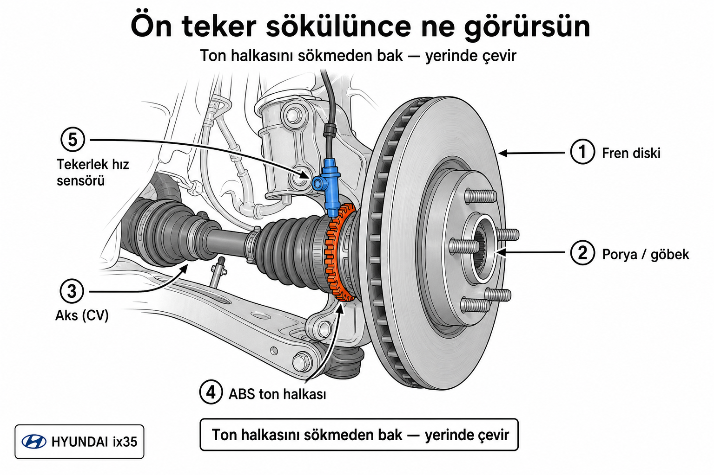

# ESP + ABS — kısa ışık / bozuk yolda fren hissi

> Kırmızı ışıkta kalkışta metal şıkırtı + sarı ESP yanıp sönmesi; bozuk yolda frende ABS “tutmuyor” hissi.

## Durum

- **Durum:** 📋 Planlama (teşhis)
- **Öncelik:** Orta–yüksek (fren/stabilite; hâlâ yanıp sönmüyorsa acil değil ama bak)
- **Tahmini bütçe:** Teşhis ucuz; sensör/tone ring ~değişken
- **Zorluk:** Orta (göz + tarama; modül işi usta)
- **Oluşturulma:** 2026-09-02
- **Son güncelleme:** 2026-09-02 (kesinlik analizi + hafta sonu planı)

## Araç bilgisi (ortak)

[araba/ozellikler.md](../../araba/ozellikler.md) · [araba/notlar.md](../../araba/notlar.md) · [araba/bakim.md](../../araba/bakim.md)

## Olay (kullanıcı — 2026-09-02)

1. Kırmızı ışık, vites boş → 1’e attı, kalktı. Önünde araç var; çok ani kalkış değil.
2. Altından **metal şıkırtı**; gösterge **sarı ESP** yanıp söndü (~1–2 sn), sonra söndü. Başka bir şey yok.
3. Ayrı gözlem: titrek/bozuk yolda frene basınca ABS **düzgün tutmuyor** gibi (2016 Ibiza’da böyle hissetmemiş).
4. **2026-09-02 netleştirme:** Ses **dönen / çalışan** parçadan; alt sac / egzoz saçı değil (kullanıcı emin). Lamba ilk anda **motor arıza ışığı** sanıldı (“motor düştü / kırıldı”); aslında **sarı ESP** — motor check-engine değil. Ses “saçma” derecede ürkütücüydü.

## Lamba: motor değil

| | Motor (check engine) | ESP (bu olay) |
|--|----------------------|---------------|
| Tipik renk | Genelde turuncu/sarı motor ikonu | **ESP** yazısı / kayma ikonu (sarı) |
| Anlam | Motor/ECU | Teker hız / denge / çekiş |
| Bu olay | Değil | Kısa yanıp söndü |

Motor “kırılmış” senaryosu bu anlatımla **uyuşmuyor**: araç kalktı, lamba söndü, sonra normal devam.

## İki olayın alakası var mı?

**Olabilir — aynı donanım ailesi.** ESP ve ABS aynı **tekerlek hız sensörleri**, ton halkaları (ABS ring) ve genelde aynı **ABS/ESP beyni** üzerinden çalışır.

| Senaryo | ESP kısa + dönen metal ses | Bozuk yolda “ABS garip” | Birlikte mi? |
|---------|----------------------------|-------------------------|--------------|
| **A — ABS ton halkası çatlak / gevşek (bir numaralı şüphe)** | Halka dönerken metal şıkırtı + bozuk hız sinyali → ESP | Tümsekte sinyal daha kötü | **Evet — en iyi tek açıklama** |
| **B — Tekerlek hız sensörü / konnektör** | Ses zayıf; lamba güçlü | ABS hissi bozulur | Evet (ses ayrıysa A+B) |
| **C — Aks / CV (iç–dış mafsallar)** | Kalkışta metal tık/şık | ABS’yi doğrudan açıklamaz | Ses için aday; ESP için daha zayıf |
| **D — Porya / rulman** | Dönünce metal/uğultu | Dolaylı | Mümkün; genelde süreğen |
| **E — ESP/TCS kısa müdahale** | Lamba normal-ish; **sert metal ses açıklamaz** | Ayrı | Ses dönense E yetmez |
| **F — Alt sac / egzoz saçı** | — | — | **Elenmesi** (kullanıcı: dönen parça) |

**Ibiza karşılaştırması:** SUV + farklı ABS → bozuk yolda ABS daha sık keser; tek başına arıza değil. ESP + dönen metal + bu his → **ton halkası / sensör**.

**Acil değil (şimdi):** Lamba kalıcı değil, fren “yok” değil.  
**Acil say:** ESP/ABS sürekli, fren yumuşar, ses her kalkışta / hızlanınca tekrarlar.

## En olası teşhis sırası

1. **ABS ton halkası** (aks/göbek dişli çember) — çatlak, eksik diş, gevşek; dönerken şıkırtı + ESP klasik ikili.
2. **Tekerlek hız sensörü** ucu / fiş (çamur, oksit) — özellikle aynı teker.
3. **Aks / CV** — kalkışta metal; dönüşte de tıkırtı var mı diye dinle.
4. Porya rulmanı (süreğen uğultu/şıkırtı).
5. ABS beyni (en seyrek; önce 1–2).

## Sen nasıl teşhis edersin (DIY)

### 1) Tekrar say — 1 hafta

- ESP **bir daha** yanıyor mu? Hangi durumda (kalkış, tümsek, yağmur, sağ/sol dönüş)?
- Bozuk yolda frende: pedal **titriyor** (ABS kesiyor) mı, yoksa araç **kayar/uzar** mı?
- Metal ses **sadece o bir kalkışta** mı, yoksa her 1’den kalkışta / yavaş sürüşte de mi?
- Ses **ön mü arka mı, sağ mı sol mu?** (pencere açık kısa deneme, güvenli yer).

### 2) Arıza kodu oku (en kritik adım)

Basit “motor” OBD (ELM327 ucuz) **çoğu zaman ABS/ESP kodunu okumaz** — motor ışığı zaten yanmadığı için motor tarafında kod da beklenmez.

- Gerekli: **ABS/ESP okuyan** tarayıcı.
- Bakılacak: tekerlek hız sensörü / `C1xxx` (hangi köşe).
- Kod yok ama ses dönense → yine de **ton halkasını gözle** (aralıklı arıza kod bırakmayabilir).

### 3) Gözle — sen bakabilir misin? (evet, çıkarmadan)

**Kısa cevap:** Evet. Bunlar “gizli beyin parçası” değil. Tekerleği sökünce **görülür / fenerle bakılır**. Teşhis için ton halkasını **sökmek şart değil** — yerinde çevirip bakmak yeter. Söküp değiştirmek ayrı (ve daha zor) iş.

| Parça | Nerede (ix35 / Tucson LM tipik) | Sen ne yaparsın | Sökmek? |
|-------|----------------------------------|-----------------|---------|
| **Ton halkası (ABS ring)** | Ön: aksın (CV) teker tarafında, göbek/disk arkasında **dişli metal çember** (~48 diş). | Teker sök; fenerle bak; aksı elle çevir, **tüm çevreyi** dolaş. | Kontrol için **hayır**. Değişim: halkayı aks üzerinden çekmek / bazen aks işi — paslıysa zor. |
| **Hız sensörü** | Göbek yanında küçük sensör + kablo/fiş. | Fişte oksit/su; uçta kir “kirpi” gibiyse nazik temizle. | Fiş açılır. Cıvata sökülebilir ama paslı sıkışır. |
| **Konnektör** | Sensör kablosu / çamurluk tarafı | Aç-kapa, gevşeklik | Sadece fiş |

**Güvenlik:** Düz zemin, el freni, kriko **+ sehpalar**, takoz. Sadece kriko üstünde yatma.

**Adım (ön iki teker — önce burası):**

1. Bir ön tekeri sök.
2. Disk arkası / dış CV’ye fener → dişli halkayı bul.
3. Elle yavaş çevir → her dişi bak: kırık, eksik, çatlak, gevşek, kalın pas topağı.
4. Sensör ucu: talaş/çamur yapışmış mı → temizle (ucu zımparalama).
5. Diğer ön teker. Taraf biliyorsan oradan başla.
6. İstersen arka (2WD’de biraz daha sıkışık olabilir).

**Kötü işaret:** eksik/kırık diş, çatlak halka, sensöre sürtme izi.  
**Tek başına kötü değil:** hafif yüzey pasi (dişler düzgünse).

**Yapma:** Halkayı tornavidayla zorla sökmek; sehpasız teker altında çalışmak.

Lastik basınçları eşit olsun.

**Şematik (nereye bakıyorsun):**



- **Turuncu (4):** ABS ton halkası — dişli çember, aksın üstünde  
- **Mavi (5):** Tekerlek hız sensörü — ucu dişlere bakıyor  
- Teker yokken fren diski (1) + porya (2) + aks (3) böyle durur. Halkayı **sökmeden** yerinde çevir.

### Bu dışarıda mı? Toz/çamur girmez mi? Nasıl çalışıyor?

**Evet, teker yuvasının kirli tarafında** — motor gibi kapalı kutu değil. Ama “açık havada çıplak sensör” de değil: taşıyıcı + disk + bazen sac kalkan arasında, küçük bir **hava boşluğu** (~0,4–1,5 mm) ile dişlere bakıyor.

**Nasıl çalışıyor (kaba):**  
Ton halkası aks/tekerle **döner** → dişler sensörün önünden geçer → sensör (Hall / aktif tip) her dişte **elektrik darbesi** üretir → ABS/ESP beyni “bu teker şu hızda” der. Dört teker hızı uyumsuzsa ESP/ABS devreye girer.

**Çamur/toz neden her gün bozmuyor?**  
- Temas yok (fırça gibi sürmez); manyetik/elektronik okuma.  
- Biraz kir çoğu zaman idare eder.  
- **Kalın çamur, metal talaş, buz, taş** yapışırsa veya halka çatlarsa sinyal bozulur → aralıklı ESP tipi olay. Kirli ortam + hassas boşluk = ara sıra arıza çıkar; temizlik bu yüzden teşhis adımı.

### Teker çıkarmadan görebilir miyim?

| Yöntem | Ne görürsün | Yeterli mi? |
|--------|-------------|-------------|
| Çamurluk içinden / teker arkasından fener + ayna | Sensör gövdesi, kablo; halkanın **bir kısmı** bazen | Kısmen — tüm dişleri dolaşmak zor |
| Jant konuşlarından içeri bakmak | Bazen halkanın bir dilimi | Şans işi; disk çoğu zaman engeller |
| **Teker sökmek** | Halkanın **tam çevresi** + sensör ucu | Teşhis için **asıl doğru** yol |

**Bir bakış** için teker şart değil; “diş kırık mı / her yer temiz mi” için tekeri sökmek pratikte şart.

### 4) Yol testi (güvenli yer)

- Yumuşak 1’den kalkış tekrar: ses/lamba?
- Hafif dönüşlü kalkış: CV tıkırtısı?
- ESP tekrarlarsa taraf not et → tarama.

### 5) Yapma (şimdi)

- Motor açma / “motor kırıldı” paniğiyle parçaya saldırmak.
- ESP fişini çekmek.
- Kod/göz olmadan dört sensör birden.

## Sonraki adım (karar ağacı)

```
Dönen metal ses + kısa ESP (bu olay)
 └─ Öncelik: ABS ton halkası + sensör göz / ABS tarama
      ├─ Halka çatlak/diş eksik → halka (veya aks seti) + kod sil
      ├─ Sensör/fiş kötü → temizle/değiştir
      └─ Temiz + kod yok + bir daha olmaz → 1–2 hafta izle; ABS hissi ayrı not
```

## Açık sorular

- Ses / ESP tekrarlandı mı?
- Ön-arka / sağ-sol taraf netleşti mi?
- ABS tarama yapıldı mı?

## İlerleme

| Tarih | Not |
|-------|-----|
| 2026-09-02 | İlk olay; teşhis notu |
| 2026-09-02 | Ses dönen parça (saç değil); lamba motor sanıldı → ESP teyidi |
| 2026-09-02 | “Neden sustu?” — aralıklı arıza notu eklendi |
| 2026-09-02 | DIY: teker sökülünce halka/sensör yerinde bakılır; sökmek şart değil |
| 2026-09-02 | Kesinlik analizi: ton halkası varsayım ~%40–55; hafta sonu bak ama parça alma |

## Analiz — emin miyiz? (hayır, kesin değil)

**Dürüst cevap:** Ton halkası / hız sensörü **en iyi tek hipotez**, ama **kanıtlanmış teşhis değil**. “Kesin orası” demek yanlış olur. Bugünkü olay iki parçalı; ikisini ayırıp birleştirmek lazım.

### Hyundai kılavuzuna göre sarı ESP ne demek?

| Lamba davranışı | Anlam (Tucson/ix35 ESC) |
|-----------------|-------------------------|
| Kontak açılınca 3 sn yanıp söner | Normal self-check |
| Sürüşte **yanıp sönüyor** (blink) | ESC/TCS **o anda çalışıyor** (kayma düzeltiyor) — birçok durumda **normal** |
| **Sürekli yanık** kalıyor | Sistem arızası → tarama |

Senin tarif: **1–2 sn yanıp söndü, sonra kapandı** → kılavuz dilinde bu, “kalıcı arıza lambası”ndan çok **kısa ESC/TCS aktivasyonu** veya çok kısa aralıklı hata gibi duruyor. Yani tek başına lamba = “parça koptu” demek **değil**.

### Bugün ne olmuş olabilir? (iki katman)

```
Kalkış (1. vites)
   │
   ├─ A) Bir teker hız sinyali anlık saçmaladı veya gerçekten hafif patinaj
   │     → ESP/TCS 1–2 sn müdahale → sarı lamba blink → bitti
   │
   └─ B) Aynı anda dönen metal şıkırtı
         → bu A’dan BAĞIMSIZ da olabilir, AYNI kökenden de
```

Metal ses olmasa “ESP bir an çalıştı, normal olabilir” denebilirdi.  
**Metal ses + ESP aynı saniyede** → rastlantı ihtimali düşer; ortak mekanik (halka/aks/göbek) ihtimali yükselir. Yine de **%100 değil**.

### Güven skoru (bu bilgide — tarama/göz yok)

| Hipotez | Güven | Neden uyuyor | Neden uymayabilir |
|---------|-------|--------------|-------------------|
| **1. Ton halkası çatlak/diş + kısa ESP** | **~%40–55** | Hyundai’de bilinen: çatlak halka → aralıklı metal/ABS/ESP; ses dönen; sonra susar; bozuk yolda ABS hissi aynı aile | Tek seferlik; kalıcı ABS ışığı yok; henüz halka görülmedi |
| **2. ESC/TCS normal müdahale + ayrı mekanik ses (CV/poyra/balata)** | **~%25–35** | Blink kılavuzda “aktif ESC”; kalkışta tork; ses CV/iç mafsal olabilir | İki şeyin aynı anda rastlantısı; kullanıcı sesi “saçma/ürkütücü” |
| **3. Sensör kir/fiş anlık** | **~%15–25** | Aralıklı ESP; ABS hissi | Tek başına **sert metal** sesi zayıf açıklar |
| **4. Motor / şanzıman kırığı** | **~%0–5** | — | Lamba ESP; araç devam; motor ışığı yok |
| **5. ABS beyni** | **~%5** | — | Önce halka/sensör elenir |

**Sonuç cümlesi:** Emin değiliz. Hafta sonu **bakılacak yer doğru** (ucuz, zararsız teşhis); “orayı söktürüp değiştirelim” aşamasında **değiliz**.

### Bozuk yolda ABS hissi — aynı dosyaya mı?

- **Aynı aile olabilir** (halka/sensör) — özellikle ton halkası çatlaklarında forumlarda “düz yolda ABS tekliyor” sık.
- **Ayrı / normal de olabilir** — SUV ABS kalibrasyonu, Ibiza’dan farklı; pedal titreşimi ≠ arıza.
- Tek başına ABS hissi ile bugünkü olayı **kilitleme**.

## Hafta sonu ne yapalım?

### Evet — bak (sök = teker sök, halkayı sökme)

**Amaç:** Teşhis. Parça siparişi yok. 30–60 dk, yağ değişimi kriko düzeni.

1. Ön **iki** tekeri sırayla sök (sehpa).
2. Ton halkası: tüm çevre, çatlak/eksik diş/gevşek.
3. Sensör ucu: talaş/çamur → nazik temizle.
4. CV körüğü yırtık/gres kaçak? Aks boşluk?
5. Fren kalkanı diske sürtüyor mu? (dönen metal alternatif)
6. Foto çek (şüpheli yer).

### Hiçbir şey çıkmazsa (çok olası)

| Sonra | Ne |
|-------|-----|
| **İzle 1–2 hafta** | Ses/ESP tekrarladı mı, hangi koşulda, sağ/sol? |
| **ABS/ESP tarama** | Usta cihazı; kod yoksa bile “canlı teker hızı” varsa ideal |
| **Parça alma** | Kod veya gözle çatlak yokken alma |
| ABS hissi | Pedal titreşimi mi, fren uzaması mı ayır; uzuyorsa öne al |

Temiz halka + bir daha olay yok → büyük ihtimal **tek seferlik TCS + geçici mekanik**; dosyayı “izlemede” bırak.  
Temiz halka + olay tekrarlar → tarama zorunlu (gözle görülmeyen çatlak / kablo / beyin).

### Yapma (hafta sonu)

- “Eminiz” diye halka/aks siparişi.
- Dört sensör birden.
- Motor açmak.
- Sorun yok diye tamamen unutmak (bir not tut: tarih + tekrar var mı).

## Bu “geçti, unut” mu demek?

**Hayır** — ama **panik de değil**. Tek seferlik sönen ESP + bir metal ses = izle + ucuz göz. Kesin teşhis = göz ve/veya ABS tarama.

---

*Araç sabit bilgisi `araba/` altında; burada tekrarlanmaz.*


**Kısa cevap:** Bozuk / şüpheli hareketli parça **her zaman** sürekli ses çıkarmaz. Özellikle ABS ton halkası ve sensör arızaları çoğu zaman **aralıklıdır** (intermittent). Bir kez şıkırdar + ESP uyarır, sinyaller tekrar “normal” görünür → lamba söner, sessizlik.

### Neden sürekli olmak zorunda değil?

| Ne olabilir | Neden bir kez olup susar |
|-------------|---------------------------|
| **Ton halkasında çatlak / eksik diş** | Her turda aynı noktada bozulur ama **düşük hız / belirli yük / belirli açı**da (kalkış) daha belirgin; düz yolda sabit hızda ESP eşiğini aşmaz, ses de fark edilmez. |
| **Gevşek halka veya araya giren pas/çamur parçası** | Bir an sensöre çarpar / sinyal bozar → sonra yerinden kayar veya ezilir; bir daha (hemen) olmaz. |
| **Sensör fişi / kablo anlık kopuk** | Süspansiyon hareketi veya titreşimde 1 sn temas bozulur → ESP; sonra temas döner. Ses aslında metal sürtünme/halka, lamba elektrik. |
| **ESP’nin kendisi (TCS kesmesi)** | Beyin “kayma” sandı, müdahale etti, bitti → lamba söner. Metal ses **ayrı** (halka) veya müdahale anındaki mekanik his; sürekli arıza lambası gerekmez. |
| **CV / mafsal başlayan arıza** | İlk başta sadece **torklu kalkışta** tıklar; cruise’da sessiz. İleride sıklaşır. |

Sürekli uğultu/şıkırtı daha çok **rulman**, sürekli sürten sac, tamamen kopmuş parça gibi şeylerde olur. Senin tarif (**bir kez sert metal + 1–2 sn ESP + sonra normal**) tam da **aralıklı** profil.

### Lamba neden söndü?

ESP ışığı “parça kırıldı, kalıcı alarm” değil; çoğu araçta **o anda** sistem kendini koruyor / hata gördü demek. Koşul geçince (hızlar tekrar uyumlu) lamba **söner**. Kalıcı yanma genelde kodun “aktif arıza”da kilitlenmesi.

### Bu “geçti, unut” mu demek?

**Hayır.** Bir kez olup susması sık görülür; **tekrarlayabilir** (sonraki kalkış, tümsek, ıslak yol). O yüzden: izle + mümkünse ABS tarama / halka göz. Tek seferlik diye “asla bozuk değil” de denmez — tam tersine aralıklı arıza böyle başlar.

---

*Araç sabit bilgisi `araba/` altında; burada tekrarlanmaz.*
